# Финальное домашнее задание

**Выполнил - Третьяков Александр Юрьевич**

# Описание предметной области 

Предметной областью данной работы будет банковская сфера.

А в контексте предмета "SQL: моделирование и управление базами данных" предметной областью будет Автоматизированная Банковская Система (далее сокращённо АБС).

АБС может быть реализована как в виде монолитного ядра (что присуще действующим АБС, разработанным в начале 21 века), так и в виде микросервисов (к чему сейчас активно переходит современная разработка).

Во многом переход к микросервисной архитектуре вызван сложностью сопровождения АБС с монолитным ядром и высокими нагрузками на базу данных такой АБС, что сильно сказывается на производительности при росте клиентской базы.

Тем не менее, независимо от того, является ли АБС монолитной или микросервисной, в ней могут быть выделены ключевые сущности, которые  
являются основой для остального функционала.

В данной работе будет выполнено первое приближение к созданию АБС и будет затронута совсем небольшая по меркам АБС, но одна из ключевых сущностей — ведение договоров клиентов.

Почему именно договор клиента в АБС можно назвать ключевой сущностью?

Потому что без описания того — о чем, когда и на каких условиях банк, как одна из сторон взаимодействия, заключил договор с клиентом, будет крайне затруднительно вести автоматический учёт этих взаимодействий с миллионами клиентов.

При этом множество других важных сущностей банковского учёта будут зависеть от договора. Например, счета (из банковского плана счетов), которые будут открыты именно в рамках договора и исходя из сути договора, а не наоборот.

Может ли существовать договор без клиента?

Ответ очевиден — нет. Но является ли клиент более важной сущностью в контексте АБС, чем договор? Тоже нет. Так можно ответить по той причине, что клиент, связанный с договором, просто даёт описание одной из сторон этого договора, или другими словами, одной из его особенностей.

Почему не наоборот?  
Потому что объявляя клиента более важной сущностью, чем договор, в контексте АБС, мы всё равно будем вынуждены взаимодействовать с остальным функционалом АБС через договор (со счетами, операциями, транзакциями и т.п.).

Поэтому в данной работе будет реализована сущность АБС — договор.  
Реализация данной сущности будет представлена в виде таблицы договоров и связанной с ней таблицы истории изменений, а также таблицы типов продуктов, с использованием которых договор может быть заключён.

В работе будет реализовано ключевое "свойство" договора — клиент, в виде таблицы клиентов и связанной с ней таблицы документов клиентов.  
А также необходимый минимум для клиента, с помощью которого он может взаимодействовать с договором — это карта.

Почему именно карты как способ взаимодействия?  
Потому что работать напрямую со своими счетами клиент не может. В любом случае, если клиент пользуется онлайн-банкингом, мобильным приложением или подаёт распоряжение о переводе в отделении банка, банку необходимо отправить информацию о выполненных действиях в процессинг.  
Процессинг банку необходим не только для операций, но и для контроля единого баланса счета во всех системах. Поэтому карта как сущность взаимодействия с клиентом будет более важной, чем счёт.  
Карты будут реализованы с помощью таблицы карт и связанной с ней таблицы истории изменений.

Что даст выполнение этой работы?

Она даст основу, некий фундамент, который может быть использован для дальнейшего создания АБС в ознакомительных (а может и не только) целях.  
К этой реализации могут быть добавлены такие сущности, как банковский план счетов и проводки, транзакции и операции, биллинг и позиции, услуги и комиссии, расчёт процентов и расчёт графиков, страхование, залоги, программы лояльности, отчётность и нормативы, исполнение законодательства (блокировки по различным признакам) и тому подобное.  
Всё перечисленное будет опираться на договор и будет привязано к нему.

Также нужно отметить, что независимо от типа АБС (монолитная или микросервисная), основной функционал АБС может быть полностью реализован возможностями СУБД, например таких как Postgres, Oracle, MSSQL, что собственно и подтверждается существующей современной практикой. Поэтому использование Postgres в данном задании является вполне уместным и оправданным, как и наоборот, данное задание необходимо реализовывать именно средствами СУБД.

Средствами СУБД могут быть реализованы такие ключевые для АБС действия, как закрытие операционного дня, биллинг, выполнение операции, аудит и историчность. Все эти функции могут быть выполнены с помощью хранимых процедур и функций, которые будут исполняться в рамках заданий (job).

Поэтому в рамках работы будет реализована небольшая часть такого функционала, а именно триггеры аудита (проверки корректности) полей таблиц, а также триггеры ведения историчности — а именно сохранения части данных в отдельные таблицы. А также реализованы хранимые процедуры заведения договора и карты — часть кода, необходимого для взаимодействия с внешними системами. Реализация данных процедур создания отнюдь не является избыточной. Она позволяет осуществлять все необходимые проверки и реализовать полный контроль параметров создания, не полагаясь в вопросах корректности на внешние системы и выполняемый в них SQL-код.

Подводя итог описанному выше, в работе необходимо реализовать следующие ключевые компоненты АБС, построенные вокруг центральной сущности — договора:

1. Ядро договорной системы — таблицу договоров (`crp_agreements`) с поддержкой жизненного цикла, статусов и финансовых условий.

2. Справочник продуктов — таблицу банковских продуктов (`crp_products`), определяющих типы и условия договоров.

3. Клиентский модуль — таблицу клиентов (`mgc_clients`) с персональными данными и связанную таблицу документов (`mgc_cl_dcm`).

4. Модуль карточного обслуживания — таблицу карт (`crp_cards`) как инструмента доступа к договору, с поддержкой перевыпуска и иерархии (основные/дополнительные).

5. Систему аудита и истории — отдельные таблицы истории изменений договоров (`crp_agr_hist`) и карт (`crp_cards_hist`).

6. Бизнес-логику на уровне СУБД — хранимые процедуры для создания договоров и карт с валидацией, триггеры для автоматического аудита и поддержки историчности.

7. Управление нумерацией — механизм генерации уникальных номеров договоров через sequence с синхронизацией.

Таким образом, работа будет представлять собой часть ядра полноценной АБС, построенное вокруг договора, с полным циклом сопровождения клиента, продукта и средства доступа, реализованное средствами PostgreSQL с акцентом на целостность данных, аудит и возможность последующего расширения.

<div style="page-break-after: always;"></div>

# Проектирование базы данных для пердметной области

## Название системы: BNK (Transaction Banking Group)  
### Цель:  
Управление клиентскими отношениями, договорами и банковскими картами для физических лиц.

### Основные бизнес-процессы:

1. **Управление клиентами (физическими лицами)**  
   - Регистрация и ведение анкетных данных  
   - Хранение документов, удостоверяющих личность  
   - Оценка рисков клиентов  

2. **Продуктовый каталог**  
   - Определение характеристик банковских продуктов  
   - Кредитные карты, дебетовые карты, кредиты, депозиты  

3. **Договорная работа**  
   - Заключение договоров на продукты  
   - Управление статусами договоров  
   - Установка кредитных лимитов  
   - Контроль просрочек  

4. **Карточный бизнес**  
   - Выпуск банковских карт (VISA, MasterCard, MIR)  
   - Управление жизненным циклом карт  
   - Выпуск дополнительных карт  
   - Перевыпуск карт  

5. **История изменений**  
   - Аудит изменений договоров  
   - Аудит изменений статусов карт


### Функциональные требования

1. **Клиентская часть:**  
   - CRUD-операции для клиентов (создание, чтение, обновление, удаление)  
   - Валидация данных: ИНН, даты рождения, пол  
   - Хранение документов (паспорт, СНИЛС, ИНН и др.)  
   - Категоризация рисков (NORMAL, MEDIUM, HIGH, VERY_HIGH, BLOCKED)  

2. **Продуктовый каталог:**  
   - Определение типов продуктов: CARD, CASH, DEPO, MORG, AVTO, EDU, POS  
   - Настройка параметров: лимиты, сроки, процентные ставки  
   - Поддержка различных схем расчетов (аннуитетные, дифференцированные)  

3. **Договорное управление:**  
   - Автоматическая генерация номеров договоров  
   - 8 статусов договоров: NEW, NORM, CANC, OVDU, PEND, CLSC, SOLD, BNRT  
   - Управление датами: открытия, закрытия, предзакрытия  
   - Контроль просрочек (ovdu_cycles)  
   - Установка кредитных лимитов  

4. **Карточный бизнес:**  
   - Выпуск карт: основные (M) и дополнительные (S)  
   - 6 статусов карт: ACT, CNL, EXP, LOST, STOLEN, BLOCKED  
   - Поддержка перевыпуска (связь с предыдущей картой)  
   - Сроки действия (обычно 3 года)  
   - Активация карт клиентами  

5. **Отчетность и аудит:**  
   - Полная история изменений договоров  
   - История статусов карт  
   - Аудит действий пользователей  
   - Технические поля (created, created_by, modified, modified_by)

## Технические требования

1. **Целостность данных:**  
   - Внешние ключи между всеми связанными таблицами  
   - Уникальность ключей: договоры, номера карт, ИНН клиентов  
   - Каскадное удаление документов при удалении клиента  
   - Проверочные ограничения (CHECK constraints)  

2. **Производительность:**  
   - Индексы на все ключевые поля для поиска  
   - Частичные индексы для NULL-значений  
   - Индексы по статусам и датам для отчетности  

3. **Безопасность:**  
   - Аудит изменений всех ключевых таблиц  
   - Фиксация пользователя, внесшего изменения  
   - Ограничение значений через ENUM-подобные проверки  

4. **Жизненный цикл:**  
   - Автоматическое обновление полей `modified` / `modified_by`  
   - Триггеры для бизнес-логики  
   - Хранимые процедуры для сложных операций

## Ключевые бизнес-правила

1. **Договор → Карта:**  
   - Один договор может иметь много карт  
   - По договору может быть только одна активная основная карта  
   - Дополнительные карты ссылаются на основную  
   - Срок действия карты не может быть меньше даты регистрации  

2. **Карточная иерархия:**  
   - Основная карта (M) — первая выпускаемая по договору  
   - Дополнительная карта (S) — привязывается к основной  
   - Перевыпущенная карта — ссылается на предыдущую версию  

3. **Валидация данных:**  
   - Дата рождения ≤ Дата регистрации  
   - Дата закрытия ≥ Дата открытия договора  
   - Кредитный лимит ≥ 0  
   - Статусы только из разрешенного списка  

4. **Нумерация:**  
   - Номера договоров генерируются автоматически  
   - Номера карт должны быть уникальны  
   - ИНН клиентов уникальны (если указаны) 

## Модели проектируемой базы

### Концептуальная модель



<div style="page-break-after: always;"></div>

#### Основные концепции

- **Договор** — центральная сущность, определяющая отношения  
- **Клиент** — физическое лицо, сторона договора  
- **Продукт** — банковская услуга (кредит, депозит, карта и т.д.)  
- **Карта** — инструмент доступа к услугам по договору  
- **Документ** — удостоверение личности клиента  

#### Бизнес-правила

- Один Клиент может иметь множество Договоров  
- Один Договор относится к одному Продукту  
- Один Договор может иметь множество Карт  
- Одна Карта связана с одним Договором и одним Клиентом  
- Один Клиент имеет множество Документов  

### Логическая модель

<div style="page-break-after: always;"></div>



Таблица 1: Клиенты (mgc_clients)
```sql
Клиент (
  client_id: PK,            -- Уникальный идентификатор
  name_cyr: string,        -- ФИО на кириллице
  last_name: string,       -- Фамилия
  first_name: string,      -- Имя
  middle_name: string,     -- Отчество
  birth_date: date,        -- Дата рождения
  tax_number: string,      -- ИНН (уникальный)
  sex: char(1),           -- Пол (M/F)
  birth_place: string,    -- Место рождения
  country: string,        -- Страна
  is_resident: boolean,   -- Признак резидента
  risk_status: enum,      -- Статус риска
  registry_date: date,    -- Дата регистрации
  death_date: date        -- Дата смерти (опционально)
)
```
Таблица 2: Документы клиентов (mgc_cl_dcm)
```sql
ДокументКлиента (
  dcm_id: PK,             -- Уникальный идентификатор
  client_id: FK → Клиент, -- Ссылка на клиента
  dcm_type_c: enum,      -- Тип документа (паспорт, СНИЛС и т.д.)
  dcm_no: string,        -- Номер документа
  dcm_date: date,        -- Дата выдачи
  dcm_issue_where: string, -- Кем выдан
  dcm_expir_date: date,  -- Дата окончания
  dcm_status: enum       -- Статус документа
)
```
Таблица 3: Продукты (crp_products)
```sql
Продукт (
  prod_type: PK,          -- Тип продукта (уникальный код)
  prod_descr: text,       -- Описание продукта
  card_type: char(1),    -- Тип карты (C-кредитная/D-дебетовая)
  agr_prod_type: enum,   -- Тип продукта (CASH, DEPO, CARD и т.д.)
  minimal_loan_value: decimal, -- Минимальная сумма
  maximal_loan_value: decimal, -- Максимальная сумма
  duration: integer,      -- Срок действия
  payment_date_freq: string, -- Частота платежей
  early_repayment: integer, -- Условия досрочного погашения
  restruct: char(1),     -- Возможность реструктуризации
  creditline: boolean    -- Признак кредитной линии
)
```
Таблица 4: Договоры (crp_agreements)
```sql
Договор (
  id: PK,                 -- Суррогатный ключ
  agreement: integer,     -- Уникальный номер договора
  productname: FK → Продукт, -- Тип продукта
  stgeneral: enum,       -- Статус договора
  main_client_id: FK → Клиент, -- Основной клиент
  open_date: date,       -- Дата открытия
  close_date: date,      -- Дата закрытия
  pre_close_date: date,  -- Дата предзакрытия
  crlimit: decimal,      -- Кредитный лимит
  ovdu_cycles: integer,  -- Циклы просрочки
  next_due_date: date,   -- Дата следующего платежа
  int_rate: decimal,     -- Процентная ставка
  modified: timestamp    -- Время последнего изменения
)
```
Таблица 5: Карты (crp_cards)
```sql
Карта (
  card_id: PK,           -- Уникальный идентификатор
  agreement: FK → Договор, -- Ссылка на договор
  client_id: FK → Клиент,  -- Владелец карты
  card_no: string,       -- Номер карты (уникальный)
  prevcardno: FK → Карта, -- Предыдущая карта (перевыпуск)
  maincardno: FK → Карта, -- Основная карта (для дополнительных)
  status_card: enum,     -- Статус карты
  expiredate: date,      -- Дата окончания
  reg_date: date,        -- Дата регистрации
  activation_date: date, -- Дата активации
  card_type: string,     -- Тип платежной системы
  card_kind: char(1)    -- Вид карты (M-основная/S-дополнительная)
)
```
Таблицы истории
```sql
ИсторияДоговоров (
  id: PK,
  agreement: FK → Договор,
  stgeneral: string,
  crlimit: decimal,
  ovdu_cycles: integer,
  next_due_date: date,
  hist_date: timestamp,
  hist_user: string
)

ИсторияКарт (
  id: PK,
  card_id: FK → Карта,
  status_card: string,
  next_annual_fee_date: date,
  stamp: timestamp,
  hist_date: date,
  hist_user: string
)
```
**Логические связи:**
- Клиент 1:N Договор
- Договор N:1 Продукт
- Договор 1:N Карта
- Клиент 1:N Документ
- Карта 0..1:0..1 Карта (рекурсивные связи)

### Физическая модель

#### Схема базы данных:
```sql
-- Схема: tbg (Transaction Banking Group)
-- Кодировка: UTF-8
-- Коллация: ru_RU.UTF-8

-- Таблицы в порядке зависимости:

-- 1. Базовые справочники
CREATE TABLE tbg.crp_products (...);
-- Индексы: PRIMARY KEY (prod_type)

CREATE TABLE tbg.mgc_clients (...);
-- Индексы: 
--   PRIMARY KEY (client_id)
--   UNIQUE (tax_number)
--   INDEX (last_name, first_name)
--   INDEX (birth_date)

-- 2. Основные таблицы
CREATE TABLE tbg.crp_agreements (...);
-- Индексы:
--   PRIMARY KEY (id)
--   UNIQUE (agreement)
--   INDEX (main_client_id)
--   INDEX (productname)
--   INDEX (stgeneral)
--   INDEX (open_date)

CREATE TABLE tbg.mgc_cl_dcm (...);
-- Индексы:
--   PRIMARY KEY (dcm_id)
--   INDEX (client_id)
--   UNIQUE (dcm_type_c, dcm_no)
--   INDEX (dcm_status)

CREATE TABLE tbg.crp_cards (...);
-- Индексы:
--   PRIMARY KEY (card_id)
--   UNIQUE (card_no)
--   INDEX (agreement)
--   INDEX (client_id)
--   INDEX (status_card)
--   INDEX (expiredate)
--   INDEX (maincardno) WHERE maincardno IS NOT NULL
--   INDEX (prevcardno) WHERE prevcardno IS NOT NULL

-- 3. Таблицы истории
CREATE TABLE tbg.crp_agr_hist (...);
-- Индексы:
--   PRIMARY KEY (id)
--   INDEX (agreement)

CREATE TABLE tbg.crp_cards_hist (...);
-- Индексы:
--   PRIMARY KEY (id)
--   INDEX (card_id)
--   INDEX (stamp)

-- 4. Sequence для нумерации
CREATE SEQUENCE tbg.agreement_seq START 1000;
```
#### Внешние ключи:
```sql
-- mgc_cl_dcm → mgc_clients
ALTER TABLE tbg.mgc_cl_dcm ADD CONSTRAINT fk_mgc_cl_dcm_client 
    FOREIGN KEY (client_id) REFERENCES tbg.mgc_clients(client_id) 
    ON DELETE CASCADE;

-- crp_agreements → mgc_clients
ALTER TABLE tbg.crp_agreements ADD CONSTRAINT fk_crp_agreements_main_client 
    FOREIGN KEY (main_client_id) REFERENCES tbg.mgc_clients(client_id);

-- crp_agreements → crp_products  
ALTER TABLE tbg.crp_agreements ADD CONSTRAINT fk_crp_agreements_product
    FOREIGN KEY (productname) REFERENCES tbg.crp_products(prod_type);

-- crp_cards → crp_agreements
ALTER TABLE tbg.crp_cards ADD CONSTRAINT fk_crp_cards_agreement
    FOREIGN KEY (agreement) REFERENCES tbg.crp_agreements(agreement);

-- crp_cards → mgc_clients
ALTER TABLE tbg.crp_cards ADD CONSTRAINT fk_crp_cards_client
    FOREIGN KEY (client_id) REFERENCES tbg.mgc_clients(client_id);

-- Рекурсивные связи в crp_cards
ALTER TABLE tbg.crp_cards ADD CONSTRAINT fk_crp_cards_prevcard
    FOREIGN KEY (prevcardno) REFERENCES tbg.crp_cards(card_no);

ALTER TABLE tbg.crp_cards ADD CONSTRAINT fk_crp_cards_maincard
    FOREIGN KEY (maincardno) REFERENCES tbg.crp_cards(card_no);

-- Таблицы истории
ALTER TABLE tbg.crp_agr_hist ADD CONSTRAINT fk_crp_agr_hist_agreement
    FOREIGN KEY (agreement) REFERENCES tbg.crp_agreements(agreement);

ALTER TABLE tbg.crp_cards_hist ADD CONSTRAINT fk_crp_cards_hist_card
    FOREIGN KEY (card_id) REFERENCES tbg.crp_cards(card_id) ON DELETE CASCADE;
```
#### Триггеры
```sql
-- 1. Аудит изменений (все таблицы)
CREATE TRIGGER trg_mgc_clients_update BEFORE UPDATE ON tbg.mgc_clients ...

CREATE TRIGGER trg_crp_agreements_update BEFORE UPDATE ON tbg.crp_agreements ...

CREATE TRIGGER trg_crp_cards_update BEFORE UPDATE ON tbg.crp_cards ...

-- 2. История изменений ключевых полей
CREATE TRIGGER trg_agreement_history AFTER UPDATE ON tbg.crp_agreements ...

CREATE TRIGGER trg_card_history AFTER UPDATE ON tbg.crp_cards ...

-- 3. Автоматическое обновление дат
CREATE TRIGGER trg_crp_cards_audit BEFORE UPDATE ON tbg.crp_cards ...
-- Обновляет status_date при изменении статуса карты
```
#### Хранимые процедуры
```sql
-- 1. Создание клиента с валидацией
CREATE PROCEDURE tbg.create_client(...)

-- 2. Создание договора с генерацией номера
CREATE PROCEDURE tbg.create_agreement(...)

-- 3. Создание карты с проверками
CREATE PROCEDURE tbg.create_card(...)

-- 4. Управление нумерацией договоров
CREATE FUNCTION tbg.get_next_agreement()
CREATE FUNCTION tbg.sync_agreement_seq()
```

---
### Анализ нормальных форм таблиц базы данных BNK

#### 1. Таблица: tbg.crp_agreements (договоры)  
**Нормальная форма:** 3НФ (третья нормальная форма)

**Обоснование:**  
- 1НФ: Все атрибуты атомарны, нет повторяющихся групп  
- 2НФ: Имеет составной ключ (id, agreement), но все неключевые атрибуты зависят от всего ключа  
- 3НФ: Нет транзитивных зависимостей неключевых атрибутов  

---

#### 2. Таблица: tbg.mgc_clients (клиенты)  
**Нормальная форма:** 3НФ

**Обоснование:**  
- 1НФ: Атомарные значения, нет составных полей  
- 2НФ: Единственный первичный ключ client_id, все атрибуты зависят от него  
- 3НФ: Нет транзитивных зависимостей (например, tax_number не определяет другие атрибуты)

---

#### 3. Таблица: tbg.crp_products (продукты)  
**Нормальная форма:** BCNF (Нормальная форма Бойса-Кодда)

**Обоснование:**  
- Ключ: prod_type (простой первичный ключ)  
- Нет нетривиальных функциональных зависимостей между неключевыми атрибутами  
- Каждый детерминант является потенциальным ключом

---

#### 4. Таблица: tbg.mgc_cl_dcm (документы клиентов)  
**Нормальная форма:** 3НФ

**Обоснование:**  
- 1НФ: Все поля атомарны  
- 2НФ: Первичный ключ dcm_id, все атрибуты зависят от него полностью  
- 3НФ: Нет транзитивных зависимостей от client_id или dcm_type_c  

**Особенность:**  
Уникальное ограничение UNIQUE (dcm_type_c, dcm_no) — бизнес-правило, не нарушающее нормализацию

---

#### 5. Таблица: tbg.crp_cards (карты)  
**Нормальная форма:** 3НФ

**Обоснование:**  
- 1НФ: Атомарные значения  
- 2НФ: Первичный ключ card_id, полная зависимость атрибутов  
- 3НФ: Нет транзитивных зависимостей, даже для рекурсивных связей  

**Особенность рекурсивных связей:**  
prevcardno и maincardno — внешние ключи на ту же таблицу  
Не создают транзитивных зависимостей, так как ссылаются на ключевые атрибуты

---

#### 6. Таблица: tbg.crp_agr_hist (история договоров)  
**Нормальная форма:** 3НФ

**Обоснование:**  
- 1НФ: Атомарные значения  
- 2НФ: Первичный ключ id, полная функциональная зависимость  
- 3НФ: Исторические данные не должны иметь транзитивных зависимостей  

**Проектное решение для денормализации:**  
Таблица дублирует часть полей из crp_agreements  
Это допустимо, так как это таблица аудита/истории  
Цель: фиксация состояния на момент изменения, независимо от будущих изменений в основной таблице

---

#### 7. Таблица: tbg.crp_cards_hist (история карт)  
**Нормальная форма:** 3НФ

**Обоснование:**  
- 1НФ: Атомарные значения  
- 2НФ: Первичный ключ id  
- 3НФ: Нет транзитивных зависимостей  

Аналогично таблице истории договоров:  
Дублирование данных из основной таблицы оправдано целью аудита  
Сохранение исторических состояний независимо от изменений

#### Сводная таблица нормальных форм

| Таблица           | Нормальная форма | Обоснование                      | Особенности             |
|-------------------|------------------|---------------------------------|------------------------|
| crp_agreements    | 3НФ              | Нет транзитивных зависимостей    | Центральная сущность    |
| mgc_clients       | 3НФ              | Простой ключ, атомарные поля     | Основная справочная     |
| crp_products      | BCNF             | Каждый детерминант — ключ        | Справочник, высшая НФ   |
| mgc_cl_dcm        | 3НФ              | Полная зависимость от ключа      | Бизнес-ограничения     |
| crp_cards         | 3НФ              | Рекурсивные FK не нарушают НФ    | Сложные связи           |
| crp_agr_hist      | 3НФ              | Аудит, денормализация оправдана | Исторические данные     |
| crp_cards_hist    | 3НФ              | Аналогично истории договоров     | Аудит изменений         |


## Реализация

Проект реализован в виде набора SQL-скриптов, которые создают базу данных банковской системы. Все файлы организованы в логическом порядке выполнения.
Так же реализовано предварительное заполнение данными таблицы клиенты и документы клиентов.

---

### Файлы проекта

### 1. Основные файлы развертывания:

- **create_all.sql**  
  - Мастер-скрипт развертывания  
  - Основной файл для запуска развертывания  
  - Последовательно вызывает все остальные скрипты  
  - Выполняет проверку созданных объектов  

- **create_db.sql**  
  - Создание базы данных и схемы  
  - Удаляет существующую базу BNK (при наличии)  
  - Создает новую базу BNK с параметрами UTF-8 и русской локалью  
  - Создает схему TBG (Transaction Banking Group)  
  - Устанавливает пути поиска  

---

### 2. Файлы создания таблиц (в порядке зависимостей):

- **create_agreements.sql**  
  - Таблица договоров (центральная сущность)  
  - `crp_agreements` — основная таблица договоров  
  - Индексы и триггеры для аудита  

- **create_agr_hist.sql**  
  - История изменений договоров  
  - `crp_agr_hist` — таблица истории договоров  

- **create_crp_products.sql**  
  - Справочник банковских продуктов  
  - `crp_products` — типы продуктов (кредиты, депозиты, карты)  

- **create_mgc_clients.sql**  
  - Таблица клиентов  
  - `mgc_clients` — физические лица  
  - Индексы по ФИО, ИНН, дате рождения  

- **create_mgc_cl_dcm.sql**  
  - Документы клиентов  
  - `mgc_cl_dcm` — паспорта, СНИЛС, ИНН и др.  

- **create_crp_cards.sql**  
  - Банковские карты  
  - `crp_cards` — карты как инструмент доступа к договору  
  - Рекурсивные связи для перевыпуска и дополнительных карт  

- **create_crp_cards_hist.sql**  
  - История изменений карт  
  - `crp_cards_hist` — аудит изменений статусов карт  

---

### 3. Файлы бизнес-логики:

- **create_set_get_agreement.sql**  
  - Управление нумерацией договоров  
  - Sequence для генерации номеров договоров  
  - Функции синхронизации sequence с существующими данными  

- **create_client_proc.sql**  
  - Хранимая процедура создания клиента  
  - `tbg.create_client()` — процедура с валидацией данных  

- **create_agreement_proc.sql**  
  - Хранимая процедура создания договора  
  - `tbg.create_agreement()` — процедура создания договора с проверками  

- **create_card_proc.sql**  
  - Хранимая процедура создания карты  
  - `tbg.create_card()` — выпуск карт с бизнес-логикой  

---

### 4. Файлы аудита и триггеров:

- **create_triggers_history.sql**  
  - Триггеры для ведения истории  
  - Автоматическая запись изменений договоров и карт в историю  

---

### 5. Файлы загрузки тестовых данных

- **load_products.sql**  
  Загрузка справочника продуктов из CSV  
  Базовые банковские продукты (кредитные, дебетовые)  
  Загрузка реализована из CSV файлов так как это наиболее вероятный сценарий загрузки данных из отдела сопровождения АБС.

- **load_clients.sql**  
  Загрузка тестовых клиентов из JSON  
  Фиктивные данные клиентов для демонстрации  
  Заргрузка реализована из JSON файла и выполняет заполнение сразу двух таблиц Клиенты и Докумнты, так как это наиболее вероятный способ загрузки данных в АБС из внешней системы.

- **create_curracc_agreements.sql**  
  Создание тестовых договоров  
  Договоры "текущего счета" для загруженных клиентов  

- **create_cards_for_agreements.sql**  
  Создание тестовых карт  
  Банковские карты для созданных договоров 


---

### Порядок развертывания

#### Способ 1: Использование мастер-скрипта (самый простой)

```bash
psql -U postgres -f create_all.sql
```
#### Мастер-скрипт create_all.sql выполняет:

- Создание структуры БД (таблицы, индексы, ключи)  
- Создание бизнес-логики (процедуры, функции, триггеры)  
- Загрузку тестовых данных (клиенты, продукты, договоры, карты)  
- Проверку корректности создания всех объектов  

#### Способ 2: Альтернативный способ: Поэтапное развертывание

```bash
# 1. Создать базу данных
psql -U postgres -f create_db.sql

# 2. Создать структуру таблиц
psql -U postgres -d bnk -f create_agreements.sql
psql -U postgres -d bnk -f create_agr_hist.sql
psql -U postgres -d bnk -f create_crp_products.sql
psql -U postgres -d bnk -f create_mgc_clients.sql
psql -U postgres -d bnk -f create_mgc_cl_dcm.sql
psql -U postgres -d bnk -f create_crp_cards.sql
psql -U postgres -d bnk -f create_crp_cards_hist.sql

# 3. Создать бизнес-логику
psql -U postgres -d bnk -f create_set_get_agreement.sql
psql -U postgres -d bnk -f create_client_proc.sql
psql -U postgres -d bnk -f create_agreement_proc.sql
psql -U postgres -d bnk -f create_card_proc.sql
psql -U postgres -d bnk -f create_triggers_history.sql

# 4. Загрузить тестовые данные
psql -U postgres -d bnk -c "\cd data"
psql -U postgres -d bnk -f load_products.sql
psql -U postgres -d bnk -f load_clients.sql
psql -U postgres -d bnk -f create_curracc_agreements.sql
psql -U postgres -d bnk -f create_cards_for_agreements.sql
```

#### Загрузка тестовых данных

- **load_products.sql**  
  Загружает справочник банковских продуктов:  
    - Минимально базовый набор дебетовых и кредитных продуктов

- **load_clients.sql**  
  Загружает тестовых клиентов из JSON в две таблицы Клиенты и Документы:  
  - 10 фиктивных клиентов с реалистичными данными  
  - ФИО, даты рождения, ИНН  
  - Документы (паспорта)  

- **create_curracc_agreements.sql**  
  Создает договоры:  
  - Для каждого клиента создается договор на текущий счет  
  - Автоматическая генерация номеров договоров  
  - Установка базовых условий  

- **create_cards_for_agreements.sql**  
  Выпускает карты:  
  - Для каждого договора выпускается банковская карта  

### Результаты развертывания

Так как скрипт развертывания содержит довольно большой по объему строк вывод в терминале, и приводит его весь не имеет смысла, в качестве иллюстрации будут преведны части вывода работы скрипта по созданию базы, наполению ее данными и проверке.


### Демострация использования реализованной базы данных.

Для демострации использования базы данных можно воспользоваться скриптами из каталог `scripts`


#### Скрипт создания кредитного договора (create_credit_agreement.sql)

Создание договора кредита, можно выполнить с помощь команды
```bash
sudo -u postgres psql -f scripts/create_loan.sql 
```

**Что делает:** Создает новый кредитный договор со статусом NEW.

---

#### Основные действия:

- Создает запись в таблице `crp_agreements` с типом продукта `CONSUMER_LOAN`  
- Устанавливает параметры: лимит 300,000 ₽, ставка 14.9%  
- Генерирует уникальный номер договора  
- Создает карту типа `LOCAL` для доступа к кредиту  
- Все операции выполняются через хранимые процедуры с валидацией  

---

**Результат:**  
Договор создан, но деньги еще не выданы (статус NEW).

После создания договора скрипт выводит дополнительную информацию с помощью следующих скриптов

```sql
-- Проверка созданного кредитного договора:'
SELECT 
    a.agreement as "Номер договора",
    a.productname as "Продукт",
    a.stgeneral  as "Статус",
    a.main_client_id as "ID клиента",
    c.last_name || ' ' || c.first_name || ' ' || COALESCE(c.middle_name, '') as "ФИО клиента",
    a.open_date as "Дата договора",
    a.close_date as "Дата закрытия",
    a.crlimit  as "Кредитный лимит",
    a.int_rate as "Ставка %"
FROM tbg.crp_agreements a
JOIN tbg.mgc_clients c ON a.main_client_id = c.client_id
WHERE a.productname IN ('CONSUMER_LOAN', 'CREDIT_CARD', 'AVTO_LOAN', 'MORTGAGE', 'EDU_LOAN')
ORDER BY a.agreement  DESC
LIMIT 1;
```

```sql
-- 'Проверка созданной карты типа LOCAL:'
SELECT 
    cr.card_no as "Номер карты",
    cr.card_type as "Тип карты",
    cr.card_kind as "Вид",
    cr.status_card  as "Статус",
    cr.expiredate as "Действует до",
    ca.agreement as "Договор",
    ca.productname as "Продукт",
    cl.client_id as "ID клиента",
    cl.last_name || ' ' || cl.first_name || ' ' || COALESCE(cl.middle_name, '') as "ФИО клиента"
FROM tbg.crp_cards cr
JOIN tbg.crp_agreements ca ON cr.agreement = ca.agreement
JOIN tbg.mgc_clients cl ON cr.client_id = cl.client_id
WHERE cr.card_type = 'LOCAL'
ORDER BY cr.card_id DESC
LIMIT 1;
```


#### Скрипт выдачи кредита (loan_disbursement.sql)

**Что делает:** Выдает деньги по договору, переводя его в статус NORM.

---

#### Основные действия:

- **Открытие счетов (заглушки):**  
  - Ссудный счет (452XXXXXX) — для учета основной суммы  
  - Процентный счет (47427XXXX) — для учета процентов  

- **Перечисление средств (заглушка):**  
  Перевод кредитного лимита с корреспондентского счета банка на ссудный счет клиента  

- **Изменение статуса:**  
  Обновление `stgeneral` с NEW на NORM  
  Автоматическая запись в историю изменений (`crp_agr_hist`)  

- **Проверка:**  
  Подтверждение изменения статуса  
  Верификация записи в истории аудита  

---

**Результат:**  
Деньги выданы, договор активен, клиент может использовать средства.


Суть выполненых скриптов можно представить в виде следующей диаграммы




<div style="page-break-after: always;"></div>

### Создание дампа базы данных.

```bash
# Переключиться на пользователя postgres
sudo su - postgres

# в терминале postgres создать дамп базы
pg_dump -F c -b -v -f "bnk_backup_$(date +%Y%m%d).dump" bnk

# Проверить
ls -lh bnk_backup_*.dump

# Выйти из postgres
exit

# Скопировать в каталог mars17
sudo cp /var/lib/postgresql/bnk_backup_20251222.dump ~/sql_final_task/bnk/

# Скопировать дамп на хост машину
scp mars17@VM-mars17:/home/mars17/sql_final_task/bnk/bnk_backup_20251222.dump .
```

Созданный дамп базы находится в каталоге `./dump`

## Итоги

Работа получилась достаточно большой по объему. Приступая к ее реализации я и сам не ожидал этого. Но и то что реализовано, лишь малая часть, некоторое приближение к реально существущим АБС.
Утверждать это мне позволяет мой большой опыт работы в Российских банках в качестве инженера сопровождения подобных АБС.

В работе остались не реализованы часть сриптов, которые должны быть выполнены с использование обобщенных табличных выражений или оконных функций. Но я посчитал, что в этом нет необходимости, это приведет лишь к генерации лишних данных, и потери фокусировки на основной сути создания и использования системы. Плюс, к тому же, подобные запросы мы уже выполняли в предыдущих заданиях.

Я искренне надеюсь, что вы смогли осилить проверку этой работы, с учетом вашей большой нагрузки, и благодарен вам за это, в не зависимости от выставленного вами результата.
